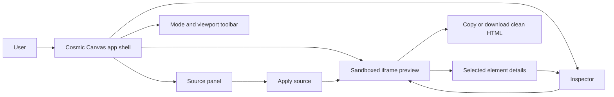
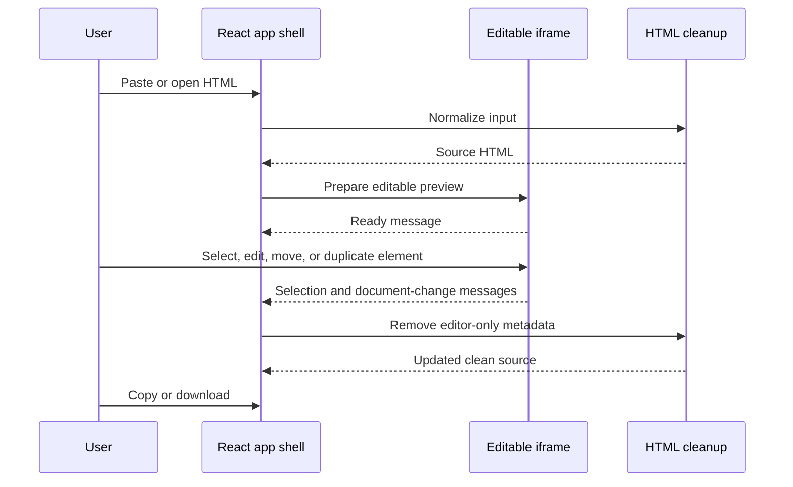
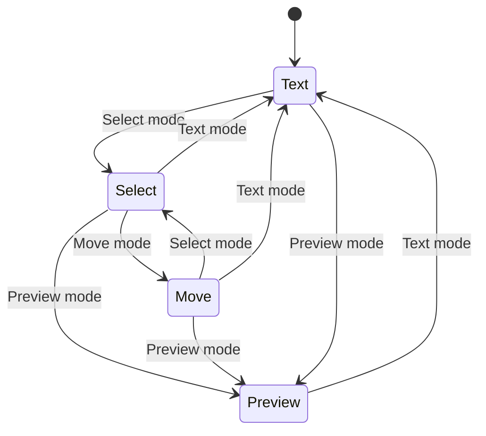
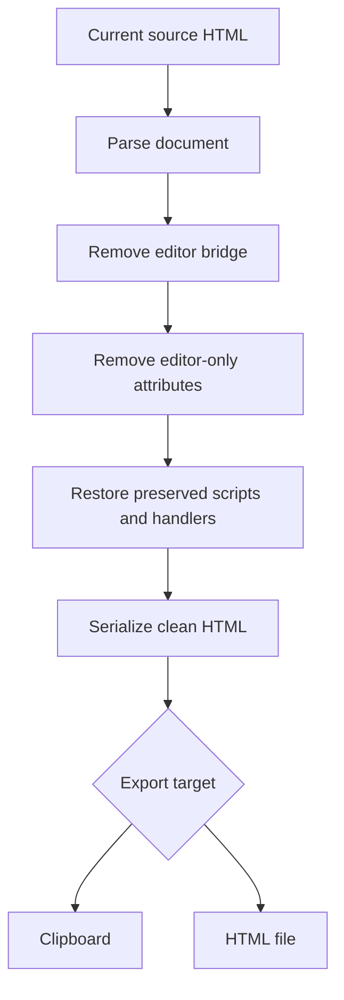

<p align="center">
  
</p>

# Cosmic Canvas

Cosmic Canvas is a free, easy-to-use WYSIWYG HTML editor for people who want to shape HTML visually without getting stuck in code. Paste a full HTML document or fragment, open a local `.html` file, preview it in the browser, click the page to edit it, and export clean HTML when it is ready.

The idea is simple: make HTML editing feel approachable. Cosmic Canvas is built for fast touch-ups, presentation polish, AI-generated page cleanup, and small web documents that need visual editing without a heavy desktop publishing workflow.

## Why Cosmic Canvas

HTML is portable, powerful, and easy to share, but it can be painful to tune by hand when all you need is a better headline, spacing fix, color change, or page layout adjustment. Cosmic Canvas gives you a visual control room for those edits while keeping the output as ordinary HTML.

Use it when you want to:

- Turn AI-generated HTML into something cleaner and more presentable.
- Touch up landing pages, reports, mockups, and one-off web documents.
- Edit text directly inside a rendered page.
- Adjust colors, spacing, sizing, borders, alignment, and positioning without hunting through source.
- Copy or download the final HTML for use somewhere else.
- Keep the workflow lightweight and free.

## Current Features

- Paste and edit raw HTML source in a syntax-highlighted CodeMirror editor.
- Open `.html` files directly, which is better than paste for very large documents.
- Save edits back to the opened file (File System Access API, with download fallback).
- Autosave a recovery draft and offer to restore it after an accidental tab close.
- Render the HTML in a sandboxed iframe.
- Click rendered elements to select them, and walk the element tree with a breadcrumb / Select parent.
- Edit text inline or through the inspector (guarded so container elements are not flattened).
- Add and remove CSS classes on the selected element.
- Replace images by URL or by uploading a local file.
- Change common styles such as text color, fill, font size, spacing, width, height, radius, and alignment.
- Move selected elements by dragging in Move mode or with nudge buttons (clean, non-stacking transforms).
- Duplicate and delete selected elements.
- Undo and redo document snapshots, with scroll position preserved.
- Keyboard shortcuts for save, undo/redo, delete, nudge, and deselect.
- Copy or download the cleaned HTML output.
- Preview desktop, tablet, and mobile widths.
- Hide or show the source panel when you want a larger visual workspace.
- Navigate detected slide decks with a bottom timeline and previous/next controls.
- Insert a new slide after the active slide or duplicate the current slide.
- Edit small CSV/TSV datasets in the Data panel and insert them as styled HTML tables.
- Optional trusted-script mode for JavaScript-driven animations.

## How It Works

Cosmic Canvas has three main work areas:

- **Source panel**: paste, inspect, or directly edit the HTML.
- **Rendered page**: see the document as a live page and select elements visually.
- **Inspector/Data panel**: edit selected text and style properties, or shape tabular data and insert it into the preview.

The app is intentionally browser-based. There is no required account, no backend service, and no document format lock-in. Your final output is still HTML.

## App Flow

Cosmic Canvas keeps the editor shell separate from the rendered document. The user edits through the React app, while the HTML document runs inside an iframe with a temporary editor bridge.



The editing loop uses browser messages between the app shell and the iframe. Visual edits update the rendered document first, then the app cleans and stores the resulting HTML source.



Editor modes keep the page behavior predictable. The same document can move between source editing, visual selection, movement, and preview without changing the final export format.



Clean export is the final checkpoint. Cosmic Canvas preserves the user document, but strips out temporary IDs, selection markers, hover markers, and editor bridge code before copy or download.



## Editing Workflow

1. Paste HTML into the source panel or use **Open file** to load a local document.
2. Click **Apply source** to render the latest source changes.
3. Choose a mode:
   - **Text** for direct text editing.
   - **Select** for picking elements and changing styles.
   - **Move** for dragging or nudging selected elements.
   - **Preview** for viewing the page without editor selection behavior.
4. Use the inspector to adjust content, color, spacing, size, alignment, and shape.
5. For slide decks, use the timeline to move between slides, duplicate a slide, or insert a new slide.
6. Use the Data panel to paste or edit CSV/TSV data, then insert it as a table into the active slide or page.
7. Preview the result at desktop, tablet, and mobile widths.
8. Copy or download the cleaned HTML.

## Keyboard Shortcuts

- **Ctrl/Cmd + S**: save to the opened file (or download a copy when the browser does not support direct file saving).
- **Ctrl/Cmd + Z**: undo. **Ctrl/Cmd + Y** or **Ctrl/Cmd + Shift + Z**: redo. (Ignored while typing in the source editor or a form field.)
- **Delete**: remove the selected element. **Escape**: deselect.
- **Arrow keys**: nudge the selected element by 8px (hold **Shift** for 1px).

Element shortcuts apply when the selected element has focus inside the preview and you are not editing its text.

## Trusted Scripts

By default, Cosmic Canvas keeps pasted scripts and inline event handlers inert while editing. That makes visual editing safer and more predictable for random or AI-generated HTML.

Enable **Trusted scripts** only for documents you trust and need to run, such as local demos or animated HTML presentations. When enabled, pasted JavaScript can execute inside the preview sandbox.

## Local Development

```powershell
npm install
npm run dev
```

Then open the local Vite URL shown in the terminal.

If npm is configured to install packages for a different operating system, install with an explicit platform override:

```powershell
npm install --os=win32 --cpu=x64
```

If Vite fails with a missing native Rollup or esbuild package on Windows, repair npm's optional native dependencies. This can happen when a user-level `.npmrc` forces another OS, such as `os=linux`.

```powershell
npm run repair:native
npm run dev
```

## Build

```powershell
npm run build
```

The static production build is written to `dist/`.

## VS Code Extension

Cosmic Canvas can also run as a VS Code custom editor for `.html` and `.htm` files.

```powershell
npm run vsix
```

The packaged extension is written to `cosmic-canvas-0.1.1.vsix`. Install it with:

```powershell
code --install-extension .\cosmic-canvas-0.1.1.vsix
```

After installation, open an HTML file with **Open With... > Cosmic Canvas** or run
**Cosmic Canvas: Open Current HTML File** from the command palette.

## Tests

```powershell
npm test
```

Unit tests (Vitest + jsdom) cover the CSV parser/serializer and the HTML
normalization, editor-bridge injection, script-inerting, and clean-export
round-trips in `src/htmlDocument.ts`.

## Editing Model

The app keeps the first version intentionally focused:

- Source edits update the text panel first. Use **Apply source** to reload the rendered preview.
- Visual edits update the source panel automatically.
- The preview injects a temporary editor bridge into the iframe. Export removes editor-only attributes and scripts.
- User-provided `<script>` tags and inline event handlers are preserved but made inert while editing, then restored on export. This keeps the editor from executing pasted behavior during visual editing.
- Enable **Trusted scripts** when the document needs its own JavaScript to render or animate. Only use that mode for HTML you trust.
- Moving elements uses CSS transforms. It is practical for presentation touch-ups, but it is not a full layout engine.

## Large HTML Stress Fixtures

Generate local stress fixtures:

```powershell
npm run stress:generate
```

This writes ignored files to `public/stress-fixtures/`:

- `large-css-10000.html`
- `large-scripted-100000.html`

Use **Open file** to load them, or fetch them from the dev server while testing. For the scripted fixture, enable **Trusted scripts** before applying/loading if you want to verify JavaScript animation.

You can also load a fixture through the URL:

```text
http://127.0.0.1:5173/?load=/stress-fixtures/large-css-10000.html
http://127.0.0.1:5173/?load=/stress-fixtures/large-scripted-100000.html&trusted=1
```

## Known Limits

- Relative assets from local files, such as `./images/foo.png`, do not automatically come along when you paste HTML. Use absolute URLs, inline assets, or keep the document self-contained.
- Trusted-script mode executes pasted JavaScript inside the sandboxed preview. It is useful for your own generated HTML, but it should not be used for untrusted documents.
- Runtime DOM changes made by a document's own scripts may affect what gets exported after visual edits.
- Moving elements is designed for practical visual adjustments, not full responsive layout design.

## License

Cosmic Canvas is released under the [MIT License](LICENSE).

## Project Direction

Cosmic Canvas is aiming to become a friendly, free editor for everyday HTML polish. Good next additions:

- Add a full element-tree panel (the inspector breadcrumb is a first step).
- Add reusable page and presentation blocks.
- Improve deck-aware editing for HTML slide decks.
- Surface the selected element's source location in the code editor.
- Offer a minimal-diff export mode that preserves original formatting.

## Deck Editing Roadmap

For HTML presentations such as the corporate deck example, the friendliest path is to add deck-aware tools on top of the existing visual editor:

1. **Deck navigator**
   - Detect repeated slide containers such as `section.slide`.
   - Add previous/next slide buttons.
   - Show a compact slide list with titles from `data-title`, `data-section`, or headings.
   - Let users duplicate, delete, reorder, and rename slides.

2. **Insert slide**
   - Add a button that creates a new slide after the current one.
   - Start with simple templates: title, title/body, metrics, chart placeholder, image/text, comparison table, agenda, closing.
   - Match the current deck's classes where possible instead of injecting unrelated styling.

3. **Component library**
   - Provide drag/drop or click-to-insert blocks: KPI cards, callouts, tables, quote blocks, timelines, Mermaid diagrams, chart canvases, and image frames.
   - Keep inserted blocks as normal HTML so the final export remains portable.

4. **Data-assisted blocks**
   - Add a small data panel for pasted CSV/JSON.
   - Bind data to reusable chart/table components.
   - Keep generated data blocks editable as regular DOM elements.

5. **Safer export**
   - Track inserted editor-created slides/components.
   - Offer a clean export that keeps user content and removes editor-only metadata.
